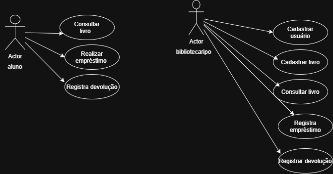

# Casos de Uso

## Atores

* Bibliotecário
* Aluno

## Casos de Uso

* Cadastrar usuário
* Cadastrar livro
* Consultar livro
* Realizar empréstimo
* Registrar devolução
* Consultar disponibilidade do livro

## Descrição

O bibliotecário é responsável pelo cadastro dos livros e usuários, além de registrar empréstimos e devoluções.

O aluno pode consultar livros disponíveis, realizar empréstimos e devolver livros.
## Diagrama UML

